# OpenLDAP 2.
## Poblar un directorio LDAP desde un fichero CSV

## 1. Crear entre todos los alumnos de la clase que vayan a hacer esta tarea un fichero CSV que incluya información personal de cada uno incluyendo los siguientes datos:

Crearemos el fichero CSV con la información de los alumnos, para ello, crearemos un fichero llamado alumnos.csv y añadiremos la siguiente información:
```
Nombre

Apellidos

Dirección de correo electrónico

Nombre de usuario

Nombre del equipo

Dirección IP del equipo

Clave pública ssh
```

En mi caso ha quedado así:
```csv
Ivan,Pina Castillo,ivanpicas88@gmail.com,ivan,ssh-rsa AAAAB3NzaC1yc2EAAAADAQABAAABgQCfYm123AV12rRYM+tPkrd0Hrzc9Py32Ov8JVZCnH5zVBj3I/IxE08LUhccSSx9aD0DrW+RdfpmLCSBTgGnbdM9eYlq3jxoBqqye4DQeXLSPyXcp/qRPGPsNO+eGypVhRB+Oq9B+ktrHgzAXQSP1yjmjN57H7GVBnMEJhpCEVXk5vWgMhVNxsDSF6lHrbiaYLtunTtt+fNgrprzXuUqhUwEDRt6/ktwad420J7kmqkB4dQuex3hV+16l1GyNH8AJzNzoinTiLr/jW8Ja0udgIknsxFvZ5Df+ACCrXfIFwvdPTm6Nya0jCm9vFx5yc5O1E07qlbAAn3FiIfS5Udjs6rNZjfFH5GmlpodhcGy4nkCYZvylnEayIa/ak4wA7oDft60hlHBMCHMoyY3ZcIkWGmVkwnTB3xfxfykPeD14zQAlIuMol9RNmPUbDYtbfY64npLPmagUIHSpwwbs1byEBbzzqzG8qcCAPUk3mK6oB5+OKUNJDv+4MM+suj+Y/PnWM8= debian@delta
Juan Jesus,Alejo Sillero,juanjesusalejosillero@gmail.com,juanje,ssh-rsa AAAAB3NzaC1yc2EAAAADAQABAAABgQDzLgcT2qKvflOcKWjUGX0ecoVWN+phHx7dEws3b/rY/xAichGJ6oP8ucD4lVJ8XVrEOaUgqQ1laPK33+u9MmzARx4g17/jKcwepUWdkKVA2++RWG3bsNgxCCkR1Gi7XMAAjwq8/17OjCj+4bvfTPlW5FSjDqaLhfqqeDtKpFJ3wjGG5sjNPC0GU4cRKzggZaR40ld7siaOiMteQ8X6bIggeXw+ULGiUhB4/uoLu0z69AzGgDfoPJuJEx4pPlcnOip/TAuL/pUjTjdUUDTsrZSJegWoLmRwylKvwtX8WojqI2TnTOyLT0IG1oStq4gC4AKOiCqfiBOm25bFfX0lW0uUaR1RjEuGz3jV0vkH3pCiuarNk5KnEQQqUO0x6ZvdCvOlsWYoiDQ6MclGKfUkUzC1uST5khs4xB1zQAZ5795on4SV8STASTwjpxuTuk7v4lTxrm8bTAF4bWiezgOQ0aFr7P0APygX0rbCR1aXoGfSyrrvqOUtkUzpiWwZwOpj0K0= juanjesus@delta.juanjesus.gonzalonazareno.org
Angel,Suarez Perez,angelsuarezperez@gmail.com,angel,ssh-rsa AAAAB3NzaC1yc2EAAAADAQABAAABgQDFEJGJIWb1KviE3kwQRoUV2C4E0d9L0mq9XjSt1kmznXSXMODJBdHwa7GOb9iwmW3OKkTa6RGokB2nKvs+2IBm9HcPYM0WM78wxEazuUvwpHR4mV58gzif/ETM48/ceQcf1fqADW1456Mfk7zFHwgf8vjyNfFCtR6NGve7wb7ojm79a9CJpqZEJ9X+EVxjbKysdvhS3BsNo5L3aJwPsAHE29+lFhDmOOzuEXWTjvFRkC1aFN1iVyxdolNJuh3onWXZDzPI55Q/DHtkpjKZ4cYqBsmwZFjWlum5aWRltgYMZtvoGOBglIxBQWjY4sl7WCiW89b+6zIcG4vWq48qhoO76ROYEPJL4pdkxxUZbjk4xApHLoO56+fXCtoo+fO/zQiHyTElzXBg/v2MmqxUrFQmQCzhbAuKK88rycZVFdIknuc+Raoi3faiX2x5N9AL4PMpEVJaTi7b/n7NMZVTkuVT9U/X9pwABSi1yngxlr2BpTg2FJD5iId15v51nx1ynXE= angelsuarez@charlie
```

## 2. Añadir el esquema openssh-lpk al directorio para poder incluir claves públicas ssh en un directorio LDAP.

Una vez que hayamos creado estos dos ficheros, tenemos que añadir el esquema openssh-lpk en nuestro servidor LDAP(Alfa). Para ello crearemos el siguiente fichero ldif con la definición del esquema en /etc/ldap/schema/:
```bash
nano /etc/ldap/schema/openssh-lpk.ldif
``` 
```ldif
dn: cn=openssh-lpk,cn=schema,cn=config
objectClass: olcSchemaConfig
cn: openssh-lpk
olcAttributeTypes: ( 1.3.6.1.4.1.24552.500.1.1.1.13 NAME 'sshPublicKey'
  DESC 'MANDATORY: OpenSSH Public key'
  EQUALITY octetStringMatch
  SYNTAX 1.3.6.1.4.1.1466.115.121.1.40 )
olcObjectClasses: ( 1.3.6.1.4.1.24552.500.1.1.2.0 NAME 'ldapPublicKey' SUP top AUXILIARY
  DESC 'MANDATORY: OpenSSH LPK objectclass'
  MAY ( sshPublicKey $ uid )
  )
```

Ahora, añadiremos el esquema al directorio LDAP con el comando:
```bash
ldapadd -Y EXTERNAL -H ldapi:/// -f /etc/ldap/schema/openssh-lpk.ldif
```

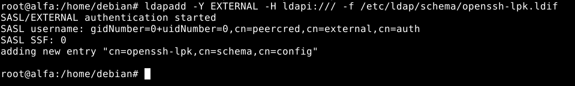

## 3. Hacer un script en bash o en python que utilice el fichero como entrada y pueble el directorio LDAP con un objeto para cada alumno utilizando los ObjectClass posixAccount e inetOrgPerson.

Pasemos ahora al script que añadirá los usuarios al directorio ldap a partir del fichero csv. He elegido realizar este script en python, usando un módulo de python llamado “pyhton3-ldap”. Como vamos a añadir un nuevo módulo al sistema, lo recomendable es que creemos un entorno virtual e instalar en dicho entorno el módulo (para que de esta forma no se produzcan problemas de versiones entre paquetes). Así pues, creamos el entorno virtual:
```bash
apt install python3-venv

python3 -m venv ldap

source ldap/bin/activate
```

Ahora instalamos el módulo correspondiente. Hay que decir que el módulo tiene algunos bugs si se utilizan determinadas versiones del mismo, por lo que he descargado e instalado una version que he comprobado que funciona:
```bash
pip install python3-ldap

pip install ldap3==2.6
```
Ahora vayamos al script en cuestión:
```bash
nano poblarusuarios.py 
```
```python
#!/usr/bin/env python

import ldap3
from ldap3 import Connection, ALL
from getpass import getpass
from sys import exit

### VARIABLES

# Shell que se le asigna a los usuarios
shell = '/bin/bash'

# Ruta absoluta del directorio que contiene los directorios personales de los usuarios. Terminado en "/"
home_dir = '/home/ldap/'

# El valor inicial para los UID que se asignan al insertar usuarios. 
uid_number = 5000

# El GID que se le asigna a los usuarios. Si no se manda al anadir el usuario da error.
gid = 5000

### VARIABLES

# Leemos el fichero .csv de los usuarios y guardamos cada linea en una lista.
with open('usuarios.csv', 'r') as usuarios:
  usuarios = usuarios.readlines()


### Parametros para la conexion
ldap_ip = 'ldap://alfa.ivan.gonzalonazareno.org:389'
dominio_base = 'dc=ivan,dc=gonzalonazareno,dc=org'
user_admin = 'admin' 
contrasena = getpass('Contrasena: ')

# Intenta realizar la conexion.
conn = Connection(ldap_ip, 'cn={},{}'.format(user_admin, dominio_base),contrasena)

# conn.bind() devuelve "True" si se ha establecido la conexion y "False" en caso contrario.

# Si no se establece la conexion imprime por pantalla un error de conexion.
if not conn.bind():
  print('No se ha podido conectar con ldap') 
  if conn.result['description'] == 'invalidCredentials':
    print('Credenciales no validas.')
  # Termina el script.
  exit(0)

# Recorre la lista de usuarios
for user in usuarios:
  # Separa los valores del usuario usando como delimitador ",", y asigna cada valor a la variable correspondiente.
  user = user.split(',')
  cn = user[0]
  sn = user[1]
  mail = user[2]
  uid = user[3]
  ssh = user[4]

  #Anade el usuario.
  conn.add(
    'uid={},ou=Personas,{}'.format(uid, dominio_base),
    object_class = 
      [
      'inetOrgPerson',
      'posixAccount', 
      'ldapPublicKey'
      ],
    attributes =
      {
      'cn': cn,
      'sn': sn,
      'mail': mail,
      'uid': uid,
      'uidNumber': str(uid_number),
      'gidNumber': str(gid),
      'homeDirectory': '{}{}'.format(home_dir,uid),
      'loginShell': shell,
      'sshPublicKey': str(ssh)
      })

  if conn.result['description'] == 'entryAlreadyExists':
    print('El usuario {} ya existe.'.format(uid))

  # Aumenta el contador para asignar un UID diferente a cada usuario (cada vez que ejecutemos el script debemos asegurarnos de ante mano que no existe dicho uid en el directorio ldap, o se solaparian los datos)
  uid_number += 1

#Cierra la conexion.
conn.unbind()
```

Ahora ejecutamos el script:
```bash
python3 poblarusuarios.py 
```

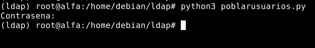


Comprobamos que se han añadido los usuarios:
```bash
ldapsearch -x -LLL -b dc=ivan,dc=gonzalonazareno,dc=org -D "cn=admin,dc=ivan,dc=gonzalonazareno,dc=org" -W
```

- Iván:

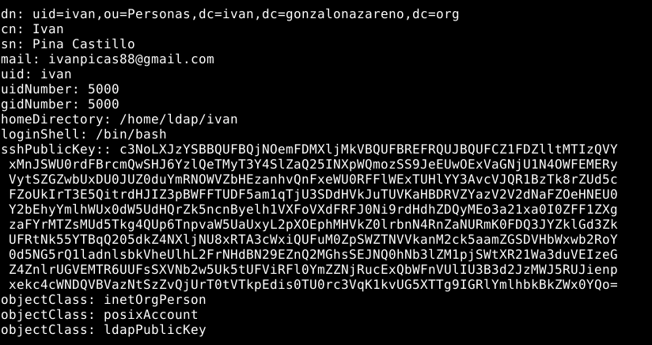

- Juanje:

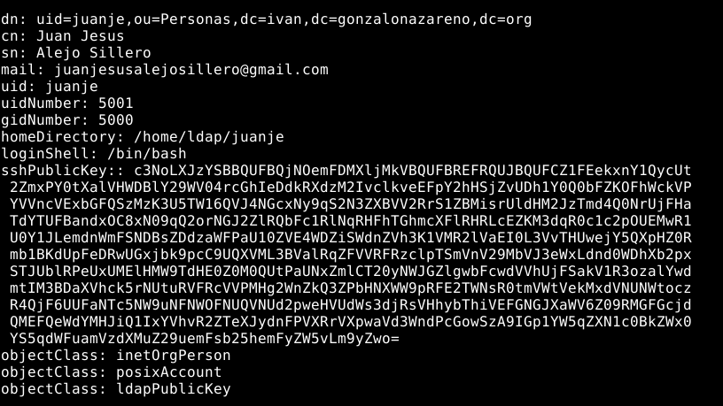

- Ángel:

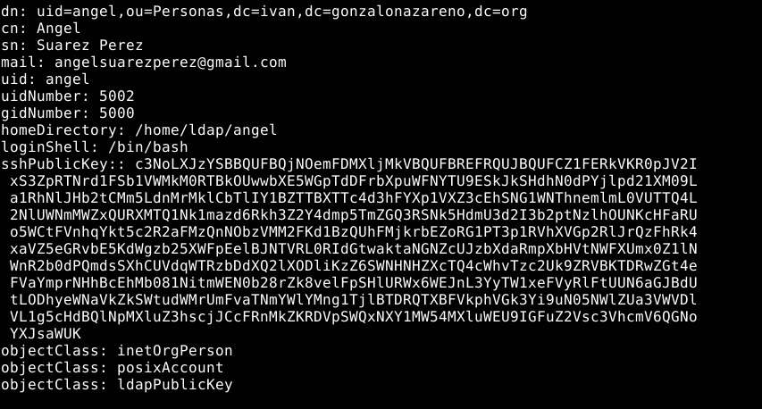

## 4. Configurar el sistema para que sean válidos los usuarios del LDAP.

Para ello nos debemos ir al fichero /etc/ldap/ldap.conf del cliente y cambiar la siguiente información:
```bash
nano /etc/ldap/ldap.conf

BASE dc=ivan,dc=gonzalonazareno,dc=org
URI ldap://alfa.ivan.gonzalonazareno.org
```

## 5. Configurar el servicio ssh para que permita acceder a los usuarios del LDAP utilizando las claves públicas que hay allí, en lugar de almacenarlas en .ssh/authorized_keys, que sólo permita acceder a los equipos que estén en el LDAP en lugar del fichero .ssh/known_hosts y que se cree el directorio "home" al vuelo.

Para que al acceder con dichos usuarios se cree el directorio home del usuario, debemos ejecutar lo siguiente:
```bash
echo "session    required        pam_mkhomedir.so" >> /etc/pam.d/common-session
```

Pasemos a configurar el sistema para que acepte el acceso por ssh a los usuarios que tengan sus claves públicas en el directorio de ldap.

Para empezar debemos crear un script que busque las claves públicas registradas al usuario indicado. Debido a algunos parámetros de seguridad de ssh, se nos requiere que el script en cuestión se encuentre en un directorio perteneciente a root y que el script tenga unos permisos concretos. Así pues, he decidido crear el script en /opt:
```bash
nano /opt/buscarclave.sh 

#!/bin/bash
ldapsearch -x -u -LLL -o ldif-wrap=no '(&(objectClass=posixAccount)(uid='"$1"'))' 'sshPublicKey' | sed -n 's/^[ \t]*sshPublicKey::[ \t]*\(.*\)/\1/p' | base64 -d
```

Y cambiamos los permisos del script:
```bash
chmod 755 /opt/buscarclave.sh 
```

- Iván:

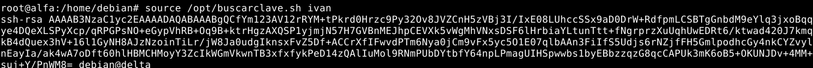

- Juanje:

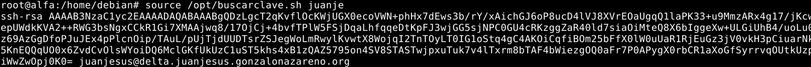

- Ángel:

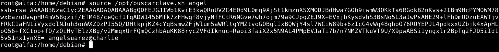

Ahora añadimos las siguientes líneas al fichero /etc/ssh/sshd_config:
```bash
nano /etc/ssh/sshd_config

AuthorizedKeysCommand /opt/buscarclave.sh
AuthorizedKeysCommandUser nobody
```

Y reiniciamos el servicio de ssh para aplicar los cambios:
```bash
systemctl restart sshd
```

## 6. Comprobar que los usuarios del LDAP pueden acceder al servidor por ssh.

### Usuario Iván:

El usuario se conecta desde su cliente:

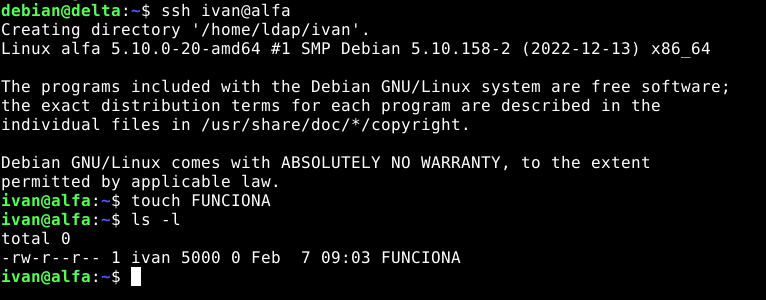

Compruebo desde el servidor que se ha creado el directorio home del usuario:

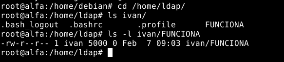

### Usuario Juanje:

El usuario se conecta desde su cliente:


Compruebo desde el servidor que se ha creado el directorio home del usuario:


### Usuario Ángel:

El usuario se conecta desde su cliente:

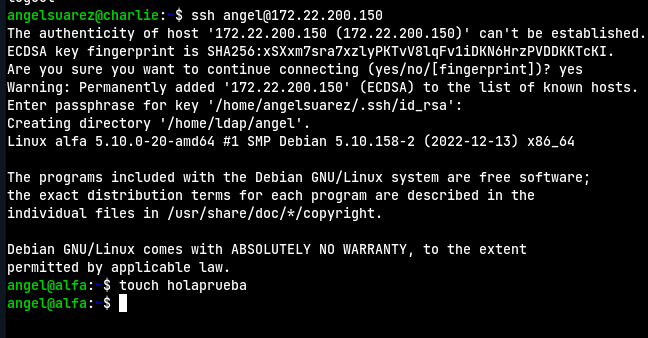

Compruebo desde el servidor que se ha creado el directorio home del usuario:

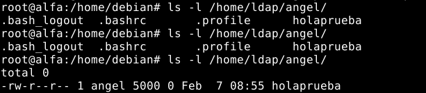
